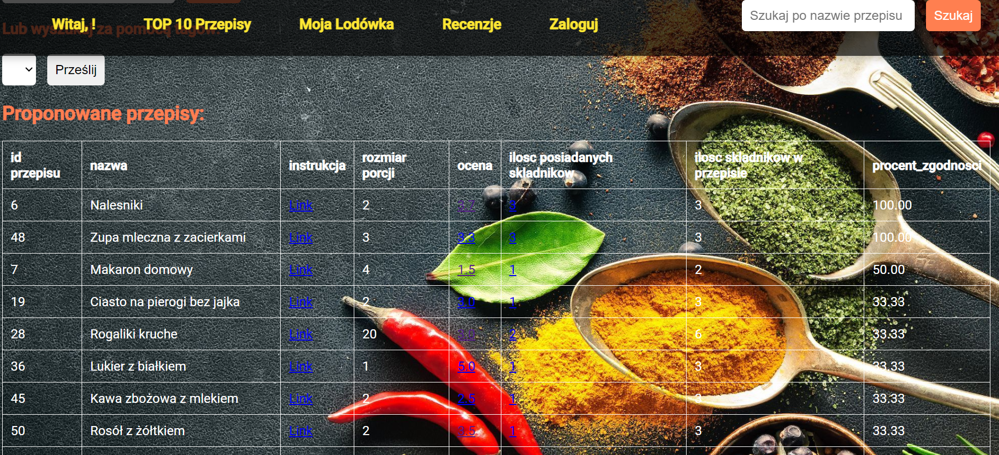
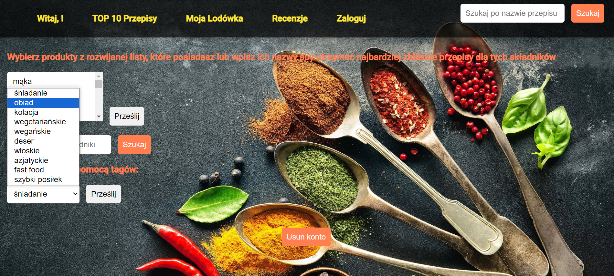
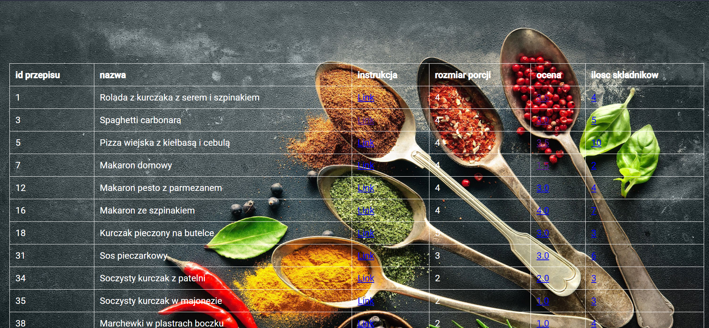
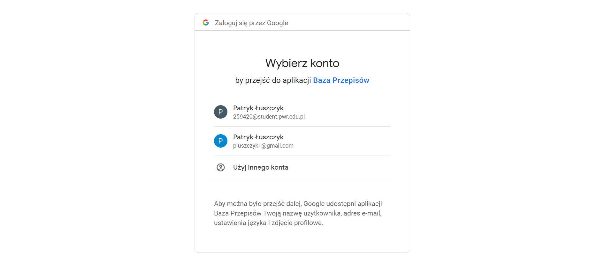
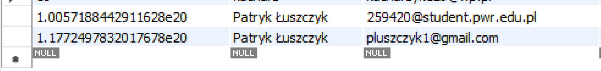
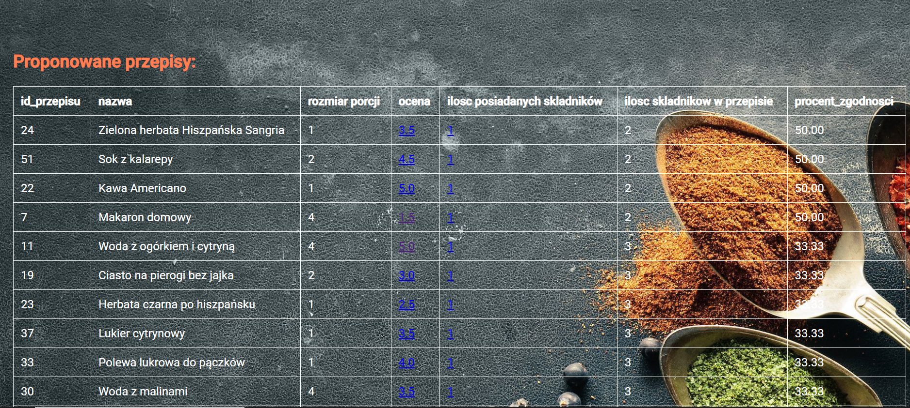
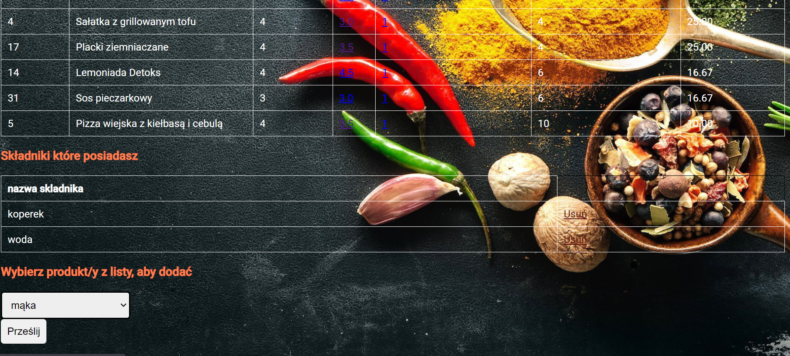
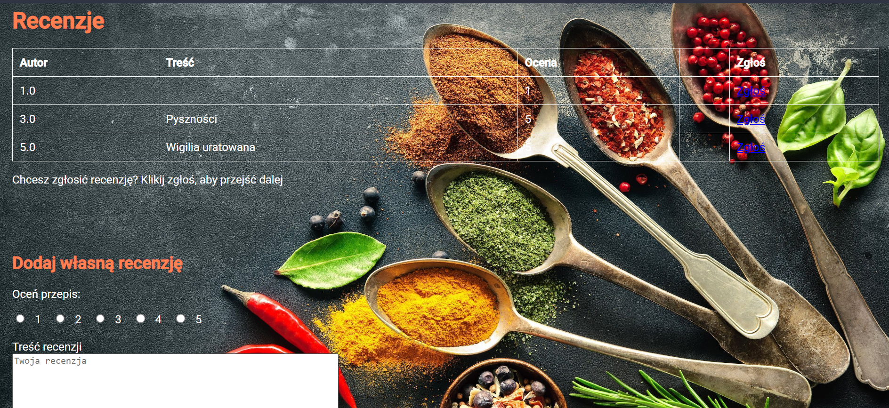
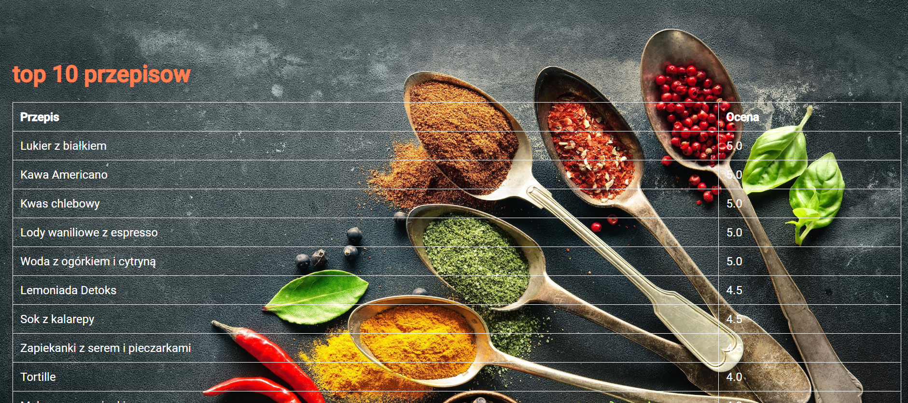

# Description

The aim of the project was to design a web application that utilizes a database, specifically a recipe database, and to create associated functionalities. The core feature is a recipe search engine based on the ingredients declared by the user. Within this framework, the application also allows for recipe searching based on names or tags. In addition to standard information like cooking instructions, portion size, and average recipe rating, the recipes also include information on the percentage of ingredient match with the user-declared products. Each registered user has their own inventory ("Moja Lodówka"), where they can add/remove products. Based on these products, the system suggests recipes, sorting them by the percentage match of the owned or declared products (in case the user, for example, does not want to log in) with the required ingredients in the recipe. Among other features, the application offers the ability to add comments/ratings for a given recipe, and the system also includes a reporting mechanism for verifying them. No passwords or other sensitive data are stored in the database. The system relies on registration/login using Single Sign-On (SSO) via Google accounts, and therefore only information such as the username and permanently assigned Google ID are stored in the database.

## Technology Overview

The project uses a variety of technologies to build a web application. Here's a brief overview:

- **Flask**: A Python web framework used for handling HTTP requests and rendering HTML templates.
- **Flask-MySQLdb**: A Flask extension that allows you to use MySQL databases with your Flask application.
- **Flask-OAuthlib**: A Flask extension for OAuth provider and consumer support.
- **HTML**: Used for structuring the web pages.
- **CSS**: Used for styling the web pages. The CSS is linked from a static folder.
- **MySQL**: A relational database used for storing user data, recipes, ingredients, etc. The database is hosted on Azure.
- **OAuth with Google**: Used for Single Sign-On (SSO) via Google accounts.
- **JavaScript**: Used for client-side scripting, such as form validation and other interactive features.

## Usage

The main page is accessible to all users and offers the ability to search for recipes based on selected ingredients from a dropdown list or manually entered ingredient names.



The above screen shows recipe suggestions for the given ingredients: milk, water, flour.


There is also the option to search for recipe suggestions based on tags.


These are the suggestions for the tag: dinner.


Access to the "Moja Lodówka" section is restricted to logged-in users. Login is done through Google SSO, and basic information for storing user data is kept in the database. Currently, since the app is not verified, the ability to log in via SSO is limited to a pool of accounts set by the app developer. Therefore, the current setup allows for login using my Gmail accounts: main and student. OAuth2 Keys are currently not exposed in github from security reasons


View of account information in the database from the left side: id, username, and email address.


Suggested recipes based on inventory.


Inventory of the logged-in user.


The user can also rate a recipe both in the form of a 1-5 scale and report a review if it violates rules.


Based on user ratings, a view of the top 10 highest-rated recipes is also generated.


## More details about database and logic in application

The database consists of 10 tables:

| Table name             | Description                                                                                          | Correlation                                                                                          |
|------------------------|------------------------------------------------------------------------------------------------------|-----------------------------------------------------------------------------------------------------|
| przepisy               | Contains a list of recipes available in the database.                                                | - przepisy_has_tagi (column id_przepis) <br> - przepis_has_skladnik (column id_przepis) <br> - user_has_przepisy (column id_przepis) <br> - przepis_has_skladnik (column id_przepis) |
| przepisy_has_skladnik  | List of ingredients based on the recipes in which these ingredients appear, along with their quantities. | - przepisy (column id_przepis) <br> - skladniki (column id_skladnik)                                |
| skladniki              | Contains a list of ingredients.                                                                       | - user_has_skladnik (column id_skladnik) <br> - gramatura (column id_gramatura)                      |
| gramatura              | Contains units used in recipes.                                                                       | - skladniki (column id_gramatura)                                                                    |
| user                   | List of users in the system.                                                                          | - user_has_przepisy (column id_user) <br> - user_has_skladnik (column user_id) <br> - recenzje (column id_user) <br> - zgloszenia (id_user) |
| user_has_skladnik      | List of products that the user declares to have.                                                      | - user (column user_id_user)                                                                         |
| recenzje               | Contains comments and ratings from users regarding recipes.                                           | - przepisy (column id_przepis) <br> - user (column id_user) <br> - zgloszenia (column user_id_user)  |
| zgloszenia             | Contains reported comments (comments that violate the rules) along with information on who reported them and why: allows one person to report a given review once. | - recenzje (column user_id_user) <br> - user (id_user)                                               |
| tagi                   | Defined list of keywords for recipe search.                                                            | - przepisy_has_tagi (column id_tag)                                                                  |
| przepisy_has_tagi      | Indicates what tags a given recipe has.                                                               | - tagi (column id_tag)                                                                               |


## Database Assumptions:

- Ingredients are defined in their basic unit (SI UNIT), according to which they are converted.
- Users can always add comments/ratings to recipes, regardless of whether they have made the recipe or not.
- Users can add any recipe to their favorites, regardless of whether they have made the recipe or not.
- All recipes in the database are not original recipes created by the database authors. The database is merely a tool to assist in finding recipes, without claiming authorship.
- If a user deletes their account, their comments and ratings are also deleted.
- The system provides a procedure for reporting comments.
- The database only stores user names, including a unique `id_user` for each user, and the necessary data required for authentication by an external site.

## SQL Database Code

### Triggers

A total of 7 triggers have been created:

#### 1) `przepisy_update_rating_insert` and `przepisy_update_rating_delete`

After adding or removing a new review, the average of all ratings for a given recipe is recalculated and saved in the 'ocena' field in the 'przepisy' table.

```
CREATE TRIGGER przepisy_update_rating_insert 
AFTER INSERT ON recenzje 
FOR EACH ROW 
BEGIN 
 UPDATE przepisy SET ocena = (SELECT AVG(ocena_user) FROM recenzje WHERE przepisy_id_przepis = NEW.przepisy_id_przepis) WHERE id_przepis = NEW.przepisy_id_przepis; 
END 
 
CREATE TRIGGER przepisy_update_rating_delete 
AFTER DELETE ON recenzje 
FOR EACH ROW 
BEGIN 
 UPDATE przepisy SET ocena = (SELECT AVG(ocena_user) FROM recenzje WHERE przepisy_id_przepis = OLD.przepisy_id_przepis) WHERE id_przepis = OLD.przepisy_id_przepis; 
END;
```


#### 2) `przeliczenie_ilosci_zgloszen_insert` and `przeliczenie_ilosci_zgloszen_delete`


It is triggered after adding/removing a report, and recalculates in the 'recenzje' table how many times a given comment has been reported.

```
CREATE TRIGGER przeliczenie_ilosci_zgloszen_insert 
AFTER INSERT ON zgloszenia 
FOR EACH ROW 
BEGIN 
UPDATE recenzje 
 	SET ilosc_zglaszen = (SELECT COUNT(*) FROM zgloszenia WHERE recenzje_przepisy_id_przepis = NEW.recenzje_przepisy_id_przepis) 
 	WHERE przepisy_id_przepis = NEW.recenzje_przepisy_id_przepis AND user_id_user = NEW.recenzje_user_id_user; 
END  

 
CREATE TRIGGER przeliczenie_ilosci_zgloszen_delete 
AFTER DELETE ON zgloszenia 
FOR EACH ROW 
BEGIN 
 UPDATE recenzje 
 SET ilosc_zglaszen = (SELECT COUNT(*) FROM zgloszenia WHERE recenzje_przepisy_id_przepis = OLD.recenzje_przepisy_id_przepis) 
 WHERE przepisy_id_przepis = OLD.recenzje_przepisy_id_przepis AND user_id_user = old.recenzje_user_id_user; 
END  
```


#### 3) `przeliczenie_ilosci_skladnikow_insert ` and `przeliczenie_ilosci_skladnikow_delete `


After adding or removing an ingredient from ‘przepisy_has_skladnik', the number of ingredients for a given recipe is recalculated, and the information is saved in the ilosc_skladnikow ' variable in the 'przepisy' table.

```
CREATE TRIGGER przeliczenie_ilosci_skladnikow_insert 
AFTER INSERT ON przepisy_has_skladniki 
FOR EACH ROW 
BEGIN 
 UPDATE przepisy 
 SET ilosc_skladnikow = (SELECT COUNT(*) FROM przepisy_has_skladniki WHERE przepisy_id_przepis = NEW.przepisy_id_przepis) 
 WHERE id_przepis = NEW.przepisy_id_przepis; 
END 
 
 
CREATE TRIGGER przeliczenie_ilosci_skladnikow_delete 
AFTER DELETE ON przepisy_has_skladniki 
FOR EACH ROW 
BEGIN 
   UPDATE przepisy SET ilosc_skladnikow = (SELECT COUNT(*) FROM przepisy_has_skladniki WHERE przepisy_id_przepis = OLD.przepisy_id_przepis) WHERE id_przepis = OLD.przepisy_id_przepis; 
END 

```

#### 4) `check_przepis_insert`


The trigger calls functions to check the validity of the data entered into the 'przepisy' table:
•	A recipe cannot have a negative portion size.
•	The rating for a given recipe can be given on a scale from 0 to 5.
•	A recipe must have at least one ingredient.


```
CREATE TRIGGER check_przepis_insert 
BEFORE INSERT ON przepisy 
FOR EACH ROW 
BEGIN 
IF NEW.rozmiar_porcji <= 0 THEN 
SIGNAL SQLSTATE '45000' SET MESSAGE_TEXT = 'Niepoprawny rozmiar porcji'; 
END IF; 
IF NEW.ocena < 0 OR NEW.ocena > 5 THEN 
SIGNAL SQLSTATE '45000' SET MESSAGE_TEXT = 'Niepoprawna ocena'; 
END IF; 
IF NEW.ilosc_skladnikow <= 0 THEN 
SIGNAL SQLSTATE '45000' SET MESSAGE_TEXT = 'Niepoprawna ilość składników'; 
END IF; 
END 


```

### Stored Procedures

A total of 12 stored procedures have been created:

#### 1) `dodaj_skladnik_do_inventory`

This procedure is responsible for adding an ingredient to a user's inventory.

```
CREATE PROCEDURE `dodaj_skladnik_do_inventory`(IN user_id INT, IN nazwa_arg VARCHAR(255), IN ilosc_arg INT) 
BEGIN 
  DECLARE skladnik_id INT; 
  SELECT id_skladniki INTO skladnik_id 
  FROM skladniki 
  WHERE nazwa = nazwa_arg; 
  INSERT INTO user_has_skladniki (user_id_user, skladniki_id_skladniki, ilosc) 
  SELECT u.id_user, s.id_skladniki, ilosc_arg 
  FROM user u 
  JOIN skladniki s ON s.id_skladniki = skladnik_id 
  WHERE u.id_user = user_id; 
END
```

#### 2) `dodawanie_nowego_składnika_do_bazy `

This procedure is responsible for adding an new ingredient to a database.

```
CREATE PROCEDURE `dodawanie_nowego_składnika_do_bazy`(IN id_skladniki INT(11), IN nazwa VARCHAR(30), IN gramatura_id_gramatura INT(11)) 
BEGIN 
   INSERT INTO skladniki (id_skladniki, nazwa, gramatura_id_gramatura) 
   VALUES (id_skladniki, nazwa, gramatura_id_gramatura); 
END  

```

#### 3) `pokaz_skladniki_uzytkownika  `

The procedure displays all the ingredients in a user's inventory.

```
CREATE PROCEDURE `pokaz_skladniki_uzytkownika`(IN user_id INT) 
BEGIN 
  SELECT skladniki.nazwa 
  FROM user_has_skladniki 
  JOIN skladniki ON user_has_skladniki.skladniki_id_skladniki = skladniki.id_skladniki 
  WHERE user_has_skladniki.user_id_user = user_id; 
END 


```

#### 4) `posiadanie_skladnikow `

Displays information on which ingredients from a recipe the user has and which they do not.


```
CREATE PROCEDURE `posiadanie_skladnikow`(IN skladniki VARCHAR(255),IN recipe_id INT) 
BEGIN 
SELECT skladniki.nazwa AS nazwa_skladnika, 
         CASE WHEN FIND_IN_SET(LOWER(skladniki.nazwa), LOWER(skladniki)) THEN 'posiadasz składnik' ELSE 'nie posiadasz' END AS posiada 
  FROM przepisy 
  JOIN przepisy_has_skladniki ON przepisy.id_przepis = przepisy_has_skladniki.przepisy_id_przepis 
  JOIN skladniki ON przepisy_has_skladniki.skladniki_id_skladniki = skladniki.id_skladniki 
  WHERE przepisy.id_przepis = recipe_id; 
END 


```

#### 5) `przepis_o_ocenie_wiekszej_niz  `

The procedure displays recipes that have a rating higher than a declared threshold.


```
CREATE PROCEDURE `przepis_o_ocenie_wiekszej_niz`(IN rating FLOAT) 
BEGIN 
   SELECT nazwa, ocena 
   FROM przepisy 
   WHERE ocena > rating; 
END 


```

#### 6) `przepisy_na_podstawie_inventory  `

Displays recipes based on the ingredients that the user has in their inventory.

```
CREATE PROCEDURE `przepisy_na_podstawie_inventory`(IN p_user_id INT) 
BEGIN 
 SELECT przepisy.nazwa,przepisy.rozmiar_porcji,przepisy.ocena, 
przepisy.ilosc_skladnikow, COUNT(*) AS ilosc_posiadanych_składników_do_przepisu, 
        przepisy.ilosc_skladnikow, 
        ROUND(CAST(COUNT(*) AS DECIMAL) / CAST(przepisy.ilosc_skladnikow AS DECIMAL) * 100, 2) AS procent_zgodnosci 
 FROM user_has_skladniki 
 JOIN skladniki ON user_has_skladniki.skladniki_id_skladniki = skladniki.id_skladniki 
 JOIN przepisy_has_skladniki ON skladniki.id_skladniki = przepisy_has_skladniki.skladniki_id_skladniki 
 JOIN przepisy ON przepisy_has_skladniki.przepisy_id_przepis = przepisy.id_przepis 
 WHERE user_has_skladniki.user_id_user = p_user_id 
 GROUP BY przepisy.id_przepis 
 ORDER BY procent_zgodnosci DESC; 
END 


```

#### 7) `przepisy_na_podstawie_podanych_skladników`

Displays recipes based on the ingredients that a given recipe contains. Used when searching for recipes by manually entering ingredients. The procedure converts all user input to lowercase.

```
CREATE PROCEDURE  
`przepisy_na_podstawie_podanych_skladników`(IN skladniki VARCHAR(255)) 
BEGIN 
SELECT przepisy.id_przepis, przepisy.nazwa, przepisy.rozmiar_porcji, przepisy.ocena, COUNT(*) AS ilosc_posiadanych_składników_do_przepisu, 
przepisy.ilosc_skladnikow as ilosc_skladnikow_w_przepisie, 
ROUND(CAST(COUNT(*) AS DECIMAL) / CAST(przepisy.ilosc_skladnikow AS DECIMAL) * 100, 2) AS procent_zgodnosci 
FROM przepisy 
JOIN przepisy_has_skladniki ON przepisy.id_przepis = przepisy_has_skladniki.przepisy_id_przepis 
JOIN skladniki ON przepisy_has_skladniki.skladniki_id_skladniki = skladniki.id_skladniki 
WHERE FIND_IN_SET(CONVERT(LOWER(skladniki.nazwa) USING utf8mb4), LOWER(CONVERT(skladniki USING utf8mb4))) 
GROUP BY przepisy.id_przepis 
ORDER BY procent_zgodnosci DESC; 
END 


```
#### 8) `skladniki_dla_przepisuid`

Searches for ingredients from a given recipe along with calculating the quantity of ingredients

```
CREATE PROCEDURE `skladniki_dla_przepisuid`(IN `recipe_id` INT) 
BEGIN 
  SELECT 
   skladniki.nazwa, (gramatura.ilosc_w_jednosce *      przepisy_has_skladniki.ilosc) as ilosc, gramatura.SI_unit 
  FROM 
    przepisy_has_skladniki 
    JOIN przepisy ON przepisy_has_skladniki.przepisy_id_przepis = przepisy.id_przepis 
    JOIN skladniki ON skladniki.id_skladniki = przepisy_has_skladniki.skladniki_id_skladniki 
    JOIN gramatura ON gramatura.id_gramatura = skladniki.gramatura_id_gramatura 
  WHERE id_przepis = recipe_id; 
END 


```
#### 9) `szukaj_po_tagu `

The procedure displays recipes that match the declared tags.

```
CREATE PROCEDURE `szukaj_po_tagu`(nazwaTag VARCHAR(255)) 
BEGIN 
  SELECT 
    * 
  FROM 
    przepisy 
    JOIN przepisy_has_tagi ON przepisy.id_przepis = przepisy_has_tagi.przepisy_id_przepis 
    JOIN tagi ON przepisy_has_tagi.tagi_id_tag = tagi.id_tag 
 WHERE tagi.nazwa = nazwaTag; 
END 


```

#### 10) `szukanie_po_nazwach `

The procedure is responsible for displaying recipes based on the ingredients that the user manually entered in the search field.
```
CREATE PROCEDURE `szukanie_po_nazwach`(IN wyszukiwanie VARCHAR(255)) 
BEGIN 
  SELECT * FROM przepisy WHERE nazwa LIKE CONCAT('%', wyszukiwanie, '%'); 
END 


```
#### 11) `usun_skladnik_z_inventory `

Involves removing a specific ingredient from a user's inventory.

```
CREATE PROCEDURE `usun_skladnik_z_inventory`(IN user_id INT, IN nazwa_skladnika VARCHAR(255)) 
BEGIN  
 DELETE FROM user_has_skladniki 
 WHERE user_id_user = user_id AND  
 skladniki_id_skladniki = (SELECT id_skladniki FROM  skladniki WHERE nazwa = nazwa_skladnika); 
END 


```

#### 12) `usuwanie_uzytkownikaa  `

Involves deleting a user from the database, along with deleting all the lists created by them, all the reviews they have given, and their entire inventory.


```
CREATE PROCEDURE `usuwanie_uzytkownikaa`(IN id_user2 INT) 
BEGIN 
  DELETE FROM zgloszenia WHERE user_id_user = id_user2; 
  DELETE FROM recenzje WHERE user_id_user = id_user2; 
  DELETE FROM user_has_przepisy WHERE user_id_user = id_user2; 
  DELETE FROM user_has_skladniki WHERE user_id_user = id_user2; 
  DELETE FROM user WHERE id_user = id_user2; 
  
END 


```


### Views

Ultimately, 3 views were created:

#### 1) `oceny_wszystkich_przepisów_i_opinie`

Displays all ratings along with reviews for all available recipes. Eventually, its use was abandoned due to implementing this functionality in a different form.

#### 2) `top_10_przepisow_wg_oceny`

Displays the top 10 recipes with the best ratings.

#### 3) `top_10_najpop_przepisow`

The 10 most popular recipes. The popularity rating is based on the number of reviews the recipe has received.

## Things to do:

- Increase the number of recipes (e.g., using a scraper and proper import from JSON files)
- Verify the application through Google so that, once it is publicly released, all users with Google accounts can log in.
